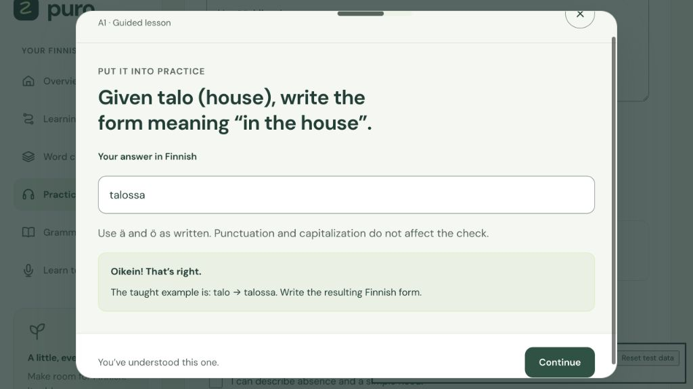

# Puro bug audit

Audited on 7 October 2026. Base commit: `7f911879887c8ac5d4362d6b9b2e1ff969bae2c8`.

The reported `talossa` rejection came from an answer key that expected the entire transformation `talo → talossa`. Both transformation exercises now ask for the resulting form and accept it. The older full example also remains valid. Lesson and question identifiers stay unchanged, so existing completion records and scheduled mistakes keep their meaning.

## Fixed findings

These rows group related bugs by their cause. Every listed change is included in this audit commit.

| Severity | Location | Before | After | Why it matters |
| --- | --- | --- | --- | --- |
| P1 | `course.js`, transformation recall | Correct `talossa` and `kylässä` answers were rejected. | Prompts explicitly request the resulting form; either that form or the taught transformation is accepted. | Correct Finnish receives correct feedback. |
| P1 | `study.js`, `app.js`, grading | Lesson and mixed checks duplicated grading logic. Unicode ellipses conflicted with the punctuation hint; empty choice values could coerce to option zero. | Both flows use one checker. Unicode punctuation is ignored; empty and invalid choices fail. Finnish letters and vowel length remain significant. | The same answer behaves consistently across study modes. |
| P2 | `study.js`, local calendar keys | Daily keys depended on a locale's formatting conventions. | Keys use local calendar components in `YYYY-MM-DD` form. | Study minutes and streaks use valid, stable keys. |
| P1 | `app.js`, save queue | An earlier queued save could show “Saved” while a later snapshot remained pending. Resolved failures could leave an old error toast visible. | Each queued snapshot receives a new generation. Retry clears the old toast and keeps pending work protected. | Save status represents the latest changes. |
| P1 | `studio.js`, `learning.js`, vocabulary | Imported review entries missing from the dictionary could break review and inflate due counts. | Those words stay visible with a missing-meaning hint. Review skips them until Add a word supplies a meaning; all due counts use the same list. | Imported progress is retained and repairable. |
| P1 | `studio.js`, `learning.js`, `app.js`, asynchronous sessions | Repeated ratings could advance a word twice. Closed or replaced sessions could be changed by late saves. A delayed writing save could skip the first prompt of a newly chosen level. | Busy guards and session/context checks keep completion attached to its original session. A failed rating is applied once across retry. Correct quiz inputs become read-only. | Slow connections and rapid navigation do not corrupt the current exercise. |
| P2 | `learning.js`, partner and mission logs | Repeated submissions could duplicate logs; failed partner saves left the submitted reflections checked. The partner summary label implied total rounds while its query counted distinct tasks. | Buttons stay busy during saves. Failed partner submissions redraw cleared reflections; retry saves the existing round. The label says “different role-plays practised.” | Practice totals and their labels agree. |
| P1 | `learning.js`, backup restore | A failed replacement save reverted the visible state while the recovery cache still held the imported state. | The current state is archived first. The confirmed replacement remains the visible pending state after failure. Old sessions and timers are cleared. | The screen, retry snapshot, and recovery copy agree. |
| P2 | `app.js`, settings | Whitespace-only names mutated the current profile before validation. Reopening the dialog retained an earlier custom validation error. | Validate before mutation and clear custom validity when opening. | Failed form submissions leave a valid learner profile. |
| P2 | `studio.js`, letter insertion | The ä/ö buttons could bypass the textarea's maximum length. | Insertion checks length, including selected text that will be replaced. | A draft cannot become too large for progress validation through the letter buttons. |
| P1 | `studio.js`, microphone lifecycle | Recorder construction failure could leave tracks active. Late recording callbacks or prompt changes could attach a clip to another context. | Tracks stop on failure, stop, navigation, account change, and page exit. Stale callbacks are ignored; discarded clip URLs are revoked. | Recording resources and clips belong to the current prompt. |
| P2 | `studio.js`, practice mode | A failed session-storage write could reset the selected mode on render. | Keep mode in memory; validate stored modes and persist when available. | Selecting Listening, Speaking, or Writing remains reliable. |
| P2 | Dialogs, listening controls, skip link | Focus could return to a removed trigger or another dialog's opener. The skip link changed the route fragment. | Each dialog keeps its own opener and finds its rendered replacement. Listening restores focus. Skip focuses main without changing the route. | Keyboard navigation remains in the intended flow. |
| P1 | `cloud.js`, response validation | Malformed save confirmations could mark recovery work clean; invalid bootstrap, partner, and recovery shapes were incompletely checked. | Validate revisions and response shapes before accepting them. Preserve pending/raw recovery data and the last valid partner summary on failure. | Invalid responses cannot silently replace protected work. |
| P2 | `styles.css`, review banner | At a 256 CSS-pixel viewport, the review button extended beyond the page. | The banner stacks at the existing small-container breakpoint and stretches within its bounds. | The action stays reachable without horizontal scrolling. |

## Verification

All production source edits passed these commands with the installed Node runtime. No dependencies were installed.

```sh
node check.mjs
node cloud-check.mjs
node seo-check.mjs
git diff --check
```

`check.mjs` covers 60 lessons, 300 answer checks, 385 unique vocabulary entries, all supplied answer keys, invalid/empty answers, Finnish diacritics and vowel length, ellipsis variants, local dates, imported words, two isolated profiles, backup validation, legacy migration, scheduling, JavaScript syntax, and static deployment configuration.

`cloud-check.mjs` covers simulated second-device loading, account ownership, stale revisions, concurrent saves, offline recovery, archived conflicts, malformed cloud responses and confirmations, invalid recovery flags, full storage, and failed backup replacement recovery.

`seo-check.mjs` checks icons and image sizes, manifest, social metadata, CSP, authenticated noindex, production URLs, preview exclusion, sitemap, invalid origin rejection, and repeated builds.

Browser testing used the app's real HTML, CSS, and modules with an isolated Supabase adapter and fake microphone implementation. The fixture used separate localhost origins and blocked external connections. It was kept outside the repository and removed after testing.

- Completed all 60 guided lessons through the interface, including all 300 questions, production notes, and completion saves.
- Completed all six level checkpoints, 15 questions each, and verified saved results.
- Reproduced and checked the transformation rejection, punctuation handling, wrong-answer feedback, read-only correct answers, unknown imported words, and word repair.
- Exercised delayed and failed saves, closed reviews, rating retries, duplicate partner submissions, mission validation and output saving, valid and invalid backup files, failed backup replacement, and retry recovery.
- Checked blank names and reopening settings; 15,000-character drafts and letter insertion; recording constructor failure, stop, prompt change, and track cleanup.
- Verified registered-email validation, failed test password feedback and focus, successful simulated sign-in, and account-change freezing with backup access.
- Checked all ten routes at 256 and 320 CSS-pixel widths after the final edits. Document width equaled viewport width throughout. The normal preview viewport was 1024 pixels. Temporary viewport overrides were reset.
- Verified keyboard skip navigation and inspected dialog/listening focus behavior. No unexpected browser console errors appeared in the inspected test tabs.
- Reproduced the delayed writing-level change, then confirmed the new level retained its first prompt. Finished one lesson with delayed saving, closed it, opened a different lesson, and confirmed the late completion did not advance that new lesson.

## Scope and remaining verification

The audit read the app modules, local/cloud storage code, database setup SQL, and deployment configuration. It did not run SQL or change live Supabase progress, users, permissions, or credentials. No secret or environment file was added. No website deployment was performed.

The complete question sweep used the course's supplied answer keys. It verifies application behavior and catches key-shape errors; it does not independently certify every translation or CEFR claim. Production microphone hardware, installed Finnish speech voices, real account credentials, cross-device live sync, OS screen readers, RTL presentation, and a full 200% zoom session were not retested. External resource availability was not exhaustively rechecked. The layout verdict is limited to the tested routes and widths.


